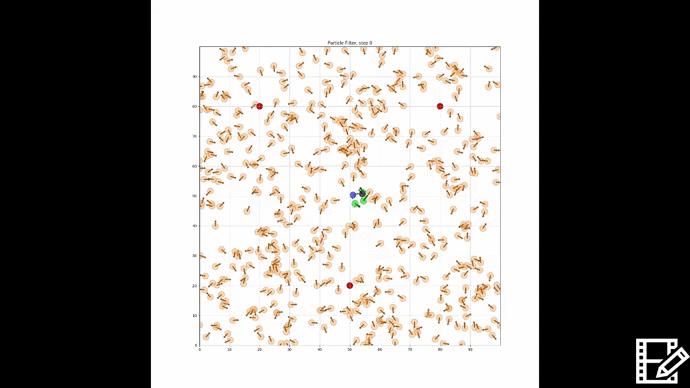

### Introduction to Particle Filters:

"Particle" methods, initially introduced in 1993,  are a class of numerical
methods which are popular in application to the estimation of problems that are
either highly non-linear or non-Gaussian in nature. Through a nonparametric implementation of the Bayes filter, the particle filter attempts to approximate the posterior distribution of the state of the system using a finite number of randomly drawn state samples. These samples drawn from the posterior, known as "particles",  each represent a hypothesis as to the true state of the system. Each particle is weighted proportionally to the probability that it represents the true state according to some proposal distribution. The combination of the particles and their weights form the estimated probability distribution. An example particle cloud at initialization is shown in the figure below. The particles carrying an "effective" probability weight are highlighted in green, with the true state in blue, and the estimated state marked in black.

  

## Particle Filtering
 This project explores two methods for the estimation of the state with particle methods developed in python. The first being the traditional style of particle filtering which incorporates importance resampling methods, and the second, applying log homotopy particle flow filtering methods as proposed by Duam and Huang ("Nonlinear filters with log-homotopy", 2007).

### Generic Algorithm for Traditional Resampling Particle Filters

1. **Propagate particles**
  * Move the particles according to the control input and model the uncertainty in the system

    ```python
    def move(self,turn,forward):
        """
        turn: variable describing the change in heading (radians)
        forward: robots present velocity
        """
        if forward < 0:
            raise ValueError('Robot can only move forward')

        #turn, and add randomness to the command
        hdg = self.hdg + float(turn) + random.gauss(0.0,self.turn_noise)
        hdg %= 2*np.pi
        dist = float(forward) + random.gauss(0.0,self.forward_noise)

        #Define x and y motion based upon new bearing relative to the x axis
        x = self.x + (cos(hdg)*dist)
        y = self.y + (sin(hdg)*dist)
        x %= self.world_size #cyclic truncate
        y %= self.world_size

        #set particles
        res = robot()
        res.set_params(self.N,self.world_size,self.landmarks)
        res.set(x,y,hdg) # changes particle's position to the new location
        res.set_noise(self.forward_noise, self.turn_noise, self.sense_noise)
        return res
    ```
2. **Update**
  * Adjust the weights of the particles based on measurements received from the robot (which are also uncertain) Those particles that more closely match the
  measurement are weighted higher than those that are do not match the received measurements as well.
  ```python
  def measurement_prob(self, measurement):
    """
    Apply weighting to particles based on recieved measurement
    """
    prob = 1.0
    for i in range(len(self.landmarks)):
        dist = sqrt((self.x - self.landmarks[i][0])**2 +  
                    (self.y-self.landmarks[i][1])**2)
        prob *= self.Gaussian(dist,self.sense_noise,measurement[i])

    return prob
    ```
3. **Resample if Necessary**
  * Calculate the number of particles that are holding an effective weight, if that number falls below some threshold (common practice dictates n_eff <= 50%), resample the particles.
  ```python
  #Function to calculate the effective sample size
  def neff(weights):
  return 1./np.sum(np.square(weights))
  ```
  * Remove particles that are highly improbable and replace them with more probable particles that are drawn proportionally to their weight and dispersed by noise. (Residual Systematic Resampling is shown below)
  ```python
  def RS_resample(N,weights, particles):
    p_new = []
    index = [0]*N #Initialize index array
    U = random.random()/N #Generate a random number between 0 and 1/N
    i  = 0
    j = -1

    while j < N-1:
        j += 1
        Ns = floor(N*(weights[j]-U))+1
        counter = 1;
        while counter <= Ns:
            index[i] = j
            i += 1
            counter += 1
        U = U + Ns/N - weights[j]

    for i in range(len(index)):
        p_new.append(particles[index[i]])
    particles = p_new

    return particles
  ```
4. **Estimate the State**
  * Compute the mean and covariance of the particle set to estimate the state of the system.
  ```python
  def estimate(weights,particles):
    """ returns mean and variance """
    pos_inter=[]

    for p in range(len(particles)):
        pos_inter.append([particles[p].x,particles[p].y,particles[p].hdg])
    pos = np.asarray(pos_inter)

    #calculate the mean estimate of the state
    mu = np.average(pos_inter, weights=weights, axis=0) # should contain x,y, and heading
    cov = np.cov(pos,rowvar=False)

    return mu, cov
  ```


 As can be seen in the figure, the present set of particles offer a poor representation of the actual state of the system.



