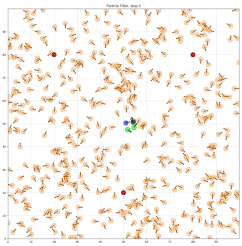
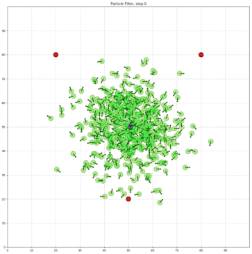
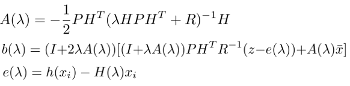
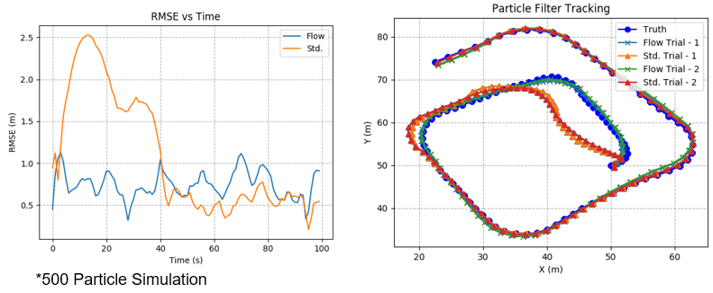

### Introduction to Particle Filters:

&nbsp;&nbsp;&nbsp;&nbsp;"Particle" methods, initially introduced in 1993,  are a class of numerical methods which are popular in application to the estimation of problems that are either highly non-linear or non-Gaussian in nature. Through a nonparametric implementation of the Bayes filter, the particle filter attempts to approximate the posterior distribution of the state of the system using a finite number of randomly drawn state samples. These samples drawn from the posterior, known as "particles",  each represent a hypothesis as to the true state of the system. Each particle is weighted proportionally to the probability that it represents the true state according to some proposal distribution. The combination of the particles and their weights form the estimated probability distribution. An example particle cloud at initialization is shown in the figure below. The particles carrying an "effective" probability weight are highlighted in green, with the true state in blue, and the estimated state marked in black.

<p align="center">
  
</p>

## Particle Filtering
 This project explores two methods for the estimation of the state with particle methods developed in python. The first being the traditional style of particle filtering which incorporates importance resampling methods, and the second, applying log homotopy particle flow filtering methods as proposed by Duam and Huang ("Nonlinear filters with log-homotopy", 2007).

### Generic Algorithm for Traditional Resampling Particle Filters

1. **Propagate particles**
  * Move the particles according to the control input and model the uncertainty in the system
  ```python
  def move(self,turn,forward):
        """
        turn: variable describing the change in heading (radians)
        forward: robots present velocity
        """
        if forward < 0:
            raise ValueError('Robot can only move forward')

        #turn, and add randomness to the command
        hdg = self.hdg + float(turn) + random.gauss(0.0,self.turn_noise)
        hdg %= 2*np.pi
        dist = float(forward) + random.gauss(0.0,self.forward_noise)

        #Define x and y motion based upon new bearing relative to the x axis
        x = self.x + (cos(hdg)*dist)
        y = self.y + (sin(hdg)*dist)
        x %= self.world_size #cyclic truncate
        y %= self.world_size

        #set particles
        res = robot()
        res.set_params(self.N,self.world_size,self.landmarks)
        res.set(x,y,hdg) # changes particle's position to the new location
        res.set_noise(self.forward_noise, self.turn_noise, self.sense_noise)
        return res
  ```
2. **Update**
  * Adjust the weights of the particles based on measurements received from the robot (which are also uncertain) Those particles that more closely match the
  measurement are weighted higher than those that are do not match the received measurements as well.

    ```python
    def measurement_prob(self, measurement):
      """
      Apply weighting to particles based on recieved measurement
      """
      prob = 1.0
      for i in range(len(self.landmarks)):
          dist = sqrt((self.x - self.landmarks[i][0])**2 +  
                      (self.y-self.landmarks[i][1])**2)
          prob *= self.Gaussian(dist,self.sense_noise,measurement[i])
      return prob
      ```

3. **Resample if Necessary**
  * Calculate the number of particles that are holding an effective weight, if that number falls below some threshold (common practice dictates n_eff <= 50%), resample the particles.

    ```python
    #Function to calculate the effective sample size
    def neff(weights):
      return 1./np.sum(np.square(weights))
    ```

    * Remove particles that are highly improbable and replace them with more probable particles that are drawn proportionally to their weight and dispersed by noise. (Residual Systematic Resampling is shown below)

    ```python
    def RS_resample(N,weights, particles):
      p_new = []
      index = [0]*N #Initialize index array
      U = random.random()/N #Generate a random number between 0 and 1/N
      i  = 0
      j = -1

      while j < N-1:
          j += 1
          Ns = floor(N*(weights[j]-U))+1
          counter = 1;
          while counter <= Ns:
              index[i] = j
              i += 1
              counter += 1
          U = U + Ns/N - weights[j]

      for i in range(len(index)):
          p_new.append(particles[index[i]])
      particles = p_new

      return particles
    ```  

4. **Estimate the State**
  * Compute the mean and covariance of the particle set to estimate the state of the system.

    ```python
    def estimate(weights,particles):
      """ returns mean and covariance """
      pos_inter=[]

      for p in range(len(particles)):
          pos_inter.append([particles[p].x,particles[p].y,particles[p].hdg])
      pos = np.asarray(pos_inter)

      #calculate the mean estimate of the state
      mu = np.average(pos_inter, weights=weights, axis=0)
      cov = np.cov(pos,rowvar=False)

      return mu, cov
    ```

 <p align="center">
   
 </p>


## Particle Flow Filtering

 In this project we have developed an implementation of the Exact Flow Filter as derived by Duam and Huang. It is to be noted that in this implementation we have foregone the use of Kalman filter prediction and updates, electing to instead apply statistics gathered from the particle distribution for the calculation of state estimates and covariance matrices.

<p align="center">
  
</p>

 Many of the same methods are implemented for the particle flow simulation in terms of the motion and tracking of the object state. The key differences lie within the departure from resampling techniques to the smooth migration of the particles from the prior to posterior distribution.

### Psuedo Time intervals
For each time step/ measurement of the system particle flow require the use of subdivisions of time to generate the flow of particles. This project implements the use of 29 exponentially distributed time steps ("Particle Filtering with Invertible Particle Flow" Yunpeng Li, Mark Coates). These time steps are generated as using the `GenerateLambda()` function.

 ```python
def GenerateLambda():
   delta_lambda_ratio = 1.2
   nLambda = 29 #number of exp spaced step sizes
   lambda_intervals = []
   for i in range(nLambda):
       lambda_intervals.append(i)

   lambda_1 = (1-delta_lambda_ratio)/(1-delta_lambda_ratio**nLambda)
   for i in range(nLambda):
       lambda_intervals[i] = lambda_1*(delta_lambda_ratio**i)

   return lambda_intervals
 ```

### Flow Parameters
Daum derives a closed form solution to the log homotopy partial differential equation for particle motion using the following equations to solve for dx/dlambda. These flow parameters are calculated for each respective particle, at a computational cost, as opposed to a global implementation from a "representative" particle. Where H is the measurement matrix, P is the covariance of the particle cloud, and R is the noise covariance.

<p align="center">
  
</p>

This is implemented below in the `calculate_flow_params()` function:

```python
def caculate_flow_params(est,P,H,R,z,pmeasure,lam):
  """
  Calculate the values for A and b for the given particle

  params:
  ----------
  est: predicted mean state estimate
  P: Covariance matrix generated from particles
  H: Measurement matrix (numpy array)
  R: Noise error matrix (numpy array)
  z: current measurement vector(numpy array)
  lam: psuedo time interval

  returns:
  ----------
  A: Flow parameter
  b: Flow parameter
  """
  HPHt = dot3(H,P,H.T)
  A_inv = inv((lam*HPHt) + R)

  A = (-0.5)*dot4(P,H.T,A_inv,H)

  I2 = eye(4)+(2*lam*A)
  I1 = eye(4)+(lam*A)
  Ri = inv(R)

  IlamAHPHt = dot4(I1,P,H.T,Ri)
  err = pmeasure - dot(H,est)
  zdif = z - err
  b5 = dot(IlamAHPHt,zdif)
  Ax = dot(A,est)

  in_sum = b5 + Ax
  b = dot(I2,in_sum)
  return A,b
```

## Filter Comparison

The `two_filters()` function is developed to implement both filters in a single
call. This function supplies both filters (and all designated trials)
with identical initialized particle sets for comparative result analysis. This
function returns the state estimates for all conducted trials, the true robot path,
and the RMSE for each filter style under test.

<p align="center">
  
</p>
